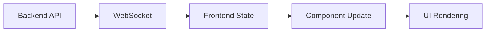
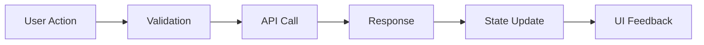
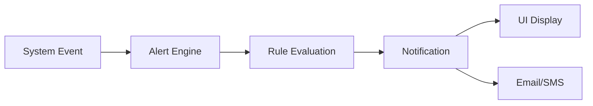

# VRidge Creator 管理者ダッシュボード UI/UX設計書

## 1. 概要

VRidge Creator管理システムの管理者ダッシュボードは、VTuberと絵師のマッチングプラットフォームの安全性、品質、パフォーマンスを監視・管理するための統合管理インターフェースです。

### 1.1 設計目標

- **リアルタイム監視**: システムとビジネスメトリクスの即座な可視化
- **効率的な管理**: ユーザー、取引、コンテンツの効率的な管理機能
- **プロアクティブなアラート**: 問題の早期発見と対応
- **データドリブンな意思決定**: 包括的なレポートと分析機能
- **アクセシビリティ**: WCAG 2.1 AA準拠のインクルーシブデザイン

### 1.2 ターゲットユーザー

- **システム管理者**: 技術的な監視と障害対応
- **カスタマーサポート**: ユーザー支援と問題解決
- **ビジネス管理者**: KPI監視と戦略的意思決定
- **セキュリティ担当**: 不正検出と対応

## 2. 設計原則

### 2.1 視覚的階層

- **重要度に基づく情報配置**: 最重要情報を上部に配置
- **カラーコーディング**: 状態（正常/警告/異常）の直感的な識別
- **適切な余白**: 認知負荷を軽減するスペーシング

### 2.2 インタラクション設計

- **3クリックルール**: 主要機能への3クリック以内でのアクセス
- **コンテキストアクション**: 関連操作の近接配置
- **フィードバック**: 操作結果の即座な視覚的フィードバック

### 2.3 不安軽減デザイン

- **安心できるカラーパレット**: 穏やかなブルー、優しいグリーン
- **明確な状態表示**: システム健康状態の分かりやすい表示
- **予測可能なレイアウト**: 一貫したナビゲーションと配置

## 3. アーキテクチャ設計

### 3.1 レイアウト構造

```
┌─────────────────────────────────────────────────────────────┐
│                    Admin Header                             │
├─────────────┬───────────────────────────────────────────────┤
│   Sidebar   │               Main Content                    │
│             ├───────────────────────────────────────────────┤
│ - 概要      │ [Alert Banner]                               │
│ - ユーザー   │                                              │
│ - 取引      │ ┌──────────┬──────────┬──────────┬──────────┐  │
│ - コンテンツ │ │ Metric   │ Metric   │ Metric   │ Metric   │  │
│ - システム   │ │ Card 1   │ Card 2   │ Card 3   │ Card 4   │  │
│ - レポート   │ └──────────┴──────────┴──────────┴──────────┘  │
│ - 設定      │                                              │
│             │ ┌─────────────────┬─────────────────────────┐  │
│             │ │  Realtime Chart │     System Monitor      │  │
│             │ │                 │                         │  │
│             │ └─────────────────┴─────────────────────────┘  │
└─────────────┴───────────────────────────────────────────────┘
```

### 3.2 ナビゲーション構造

```
/admin/
├── /                    # ダッシュボード概要
├── /users               # ユーザー管理
├── /transactions        # 取引監視
├── /content             # コンテンツ管理
├── /system              # システム監視
├── /reports             # レポート
├── /alerts              # アラート管理
└── /settings            # 設定
```

### 3.3 コンポーネント階層

```
AdminLayout
├── AdminSidebar
├── AdminHeader
├── AlertBanner
└── Pages
    ├── DashboardOverview
    │   ├── MetricCard (×4)
    │   ├── RealtimeChart (×2)
    │   └── SystemMonitor
    ├── UserManagement
    │   └── UserManagementTable
    ├── TransactionMonitoring
    ├── ContentManagement
    ├── SystemMonitoring
    ├── Reports
    ├── AlertManagement
    └── Settings
```

## 4. 主要コンポーネント設計

### 4.1 AdminSidebar

**目的**: 管理機能への一元的なナビゲーション

**特徴**:
- アイコンとテキストの組み合わせナビゲーション
- 現在位置の明確な表示
- システム稼働状態の常時表示
- レスポンシブ対応（モバイルでは折りたたみ）

**アクセシビリティ**:
- キーボードナビゲーション対応
- スクリーンリーダー対応のARIAラベル
- 十分なコントラスト比（4.5:1以上）

### 4.2 MetricCard

**目的**: 重要なKPIの視覚的表示

**設計仕様**:
- 明確な数値表示（大きなフォント）
- トレンド表示（前期比較）
- 状態に応じたカラーコーディング
- ホバー時のインタラクション

**データ更新**:
- リアルタイム更新（WebSocket経由）
- 更新タイムスタンプ表示
- ローディング状態の表示

### 4.3 RealtimeChart

**目的**: 時系列データのリアルタイム可視化

**技術仕様**:
- SVGベースの軽量チャート
- レスポンシブ対応
- インタラクティブツールチップ
- カスタマイズ可能なカラーテーマ

**パフォーマンス**:
- データポイント制限（最大100点）
- 効率的な再描画
- メモリリーク防止

### 4.4 UserManagementTable

**目的**: ユーザー情報の効率的な管理

**機能**:
- 検索・フィルタリング
- ソート機能
- ページネーション
- バルクアクション
- インラインエディット

**セキュリティ**:
- 権限に基づく表示制御
- アクション実行の確認ダイアログ
- 操作ログの記録

### 4.5 SystemMonitor

**目的**: システムメトリクスの包括的監視

**監視項目**:
- CPU使用率
- メモリ使用率
- ディスク使用率
- ネットワーク状況
- API応答時間
- データベース性能

**アラート機能**:
- 閾値ベースのアラート
- エスカレーション機能
- 通知配信

### 4.6 NotificationSystem

**目的**: システムイベントの効率的な通知管理

**機能**:
- 優先度別分類
- フィルタリング機能
- 既読管理
- アクション要求の識別

**通知タイプ**:
- `critical`: 即座の対応が必要
- `high`: 早急な対応が推奨
- `medium`: 定期確認が必要
- `low`: 情報提供

## 5. データフロー設計

### 5.1 リアルタイムデータ



### 5.2 ユーザーアクション



### 5.3 アラート配信



## 6. レスポンシブデザイン

### 6.1 ブレークポイント

- **モバイル**: 320px - 767px
- **タブレット**: 768px - 1023px
- **デスクトップ**: 1024px以上

### 6.2 レイアウト適応

**モバイル**:
- サイドバーの折りたたみ
- メトリクスカードの縦並び
- チャートのタッチ操作対応

**タブレット**:
- 2列レイアウト
- コンパクトなナビゲーション
- ジェスチャー操作

**デスクトップ**:
- 3-4列レイアウト
- 詳細情報の表示
- キーボードショートカット

## 7. アクセシビリティ設計

### 7.1 WCAG 2.1 AA準拠

**知覚可能性**:
- 十分なカラーコントラスト（4.5:1以上）
- 代替テキストの提供
- 情報の色に依存しない伝達

**操作可能性**:
- キーボードナビゲーション
- フォーカス管理
- 適切なタイムアウト設定

**理解可能性**:
- 明確なラベリング
- エラーメッセージの説明
- 一貫したナビゲーション

**堅牢性**:
- セマンティックHTML
- ARIAラベルの適切な使用
- スクリーンリーダー対応

### 7.2 インクルーシブデザイン

- **運動機能障害**: 大きなクリック領域、ドラッグ操作の回避
- **視覚障害**: 高コントラスト、音声フィードバック
- **認知障害**: シンプルなインターフェース、明確な案内

## 8. パフォーマンス最適化

### 8.1 レンダリング最適化

- React.memoの活用
- 仮想化（react-window）
- 遅延ローディング
- コード分割

### 8.2 データ最適化

- APIレスポンスの最適化
- クライアントサイドキャッシュ
- 差分更新
- WebSocket効率化

### 8.3 バンドルサイズ最適化

- Tree shakingの活用
- 動的インポート
- 外部ライブラリの最小化
- 画像最適化

## 9. セキュリティ考慮事項

### 9.1 認証・認可

- JWT トークンベース認証
- ロールベースアクセス制御
- セッション管理
- 二要素認証

### 9.2 データ保護

- 機密情報のマスキング
- HTTPS通信の強制
- XSS対策
- CSRF保護

### 9.3 操作監査

- 管理操作のログ記録
- IP アドレス追跡
- 操作履歴の保存
- 不正アクセス検出

## 10. 実装ガイドライン

### 10.1 開発環境

- **フレームワーク**: Next.js 14, React 18
- **言語**: TypeScript
- **スタイリング**: Tailwind CSS
- **状態管理**: Zustand
- **アイコン**: Heroicons

### 10.2 コーディング規約

- **ファイル命名**: PascalCase（コンポーネント）
- **関数命名**: camelCase
- **CSS クラス**: Tailwind utilities優先
- **型定義**: 厳密な型定義の徹底

### 10.3 テスト戦略

- **単体テスト**: Jest + React Testing Library
- **統合テスト**: Cypress
- **アクセシビリティテスト**: axe-core
- **パフォーマンステスト**: Lighthouse

## 11. 今後の拡張計画

### 11.1 フェーズ2機能

- **高度な分析**: 機械学習ベースの異常検出
- **カスタムダッシュボード**: ユーザー定義レイアウト
- **外部連携**: Slack、Teams通知
- **API管理**: GraphQL統合

### 11.2 国際化対応

- **多言語サポート**: i18n実装
- **地域対応**: タイムゾーン、通貨
- **RTL言語**: アラビア語、ヘブライ語
- **文化的配慮**: 色彩、レイアウト

---

**作成日**: 2025年9月18日  
**バージョン**: 1.0  
**作成者**: Interface Designer  
**承認者**: 要承認  
**次回レビュー**: 2025年10月18日